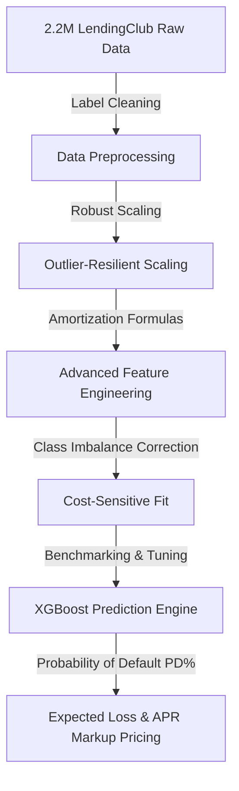

# 🏦 Retail Loan Default Prediction & Risk Analytics Sandbox

[](https://www.python.org)
[](https://retail-loan-default-prediction.streamlit.app/)
[](https://xgboost.readthedocs.io/)
[](https://scikit-learn.org/)
[](https://opensource.org/licenses/MIT)

> An end-to-end Machine Learning Pipeline & Financial Underwriting Sandbox trained on LendingClub's historical credit footprint (~2.2M borrowers). Predicts probability of default, evaluates credit risk tiers, computes expected losses, and advises pricing markup.

---

### 🌐 Live Interactive Web Application
Experience the interactive credit underwriting sandbox directly in your browser:
👉 **[Launch Retail Credit Risk Sandbox App](https://retail-loan-default-prediction.streamlit.app/)** 👈

*(Note: If you configured a different custom URL during your Streamlit deployment, you can update this link!)*

---

## 🛠️ The Tech Stack

Our credit risk architecture combines high-performance tabular classifiers with a premium, responsive web interface:

| Component | Technology | Role |
| :--- | :--- | :--- |
| **Model Ensemble** | **XGBoost & LightGBM** | State-of-the-art gradient-boosted decision trees for tabular classification. |
| **Statistical Baselines** | **Scikit-Learn** | Robust scaling (`RobustScaler`), Logistic Regression, Random Forest, Decision Tree. |
| **Web Interface** | **Streamlit** | Premium reactive frontend dashboard styled with dark-mode glassmorphic visual assets. |
| **Data & Vector Ops** | **Pandas & NumPy** | Fast vector calculations, categorical mappings, and data cleaning. |
| **Visual Analytics** | **Matplotlib & Seaborn** | Dynamic exploratory plots, correlations, ROC/AUC, and calibration curves. |
| **Auditing & Reporting** | **ReportLab** | Enterprise-grade dynamic PDF report generation engine. |

---

## 📊 Analytical & Underwriting Approach

Our credit scoring model bridges advanced statistical data science with regulatory and financial underwriting metrics:



### 1. Data Processing & Outlier Mitigation
* **Categorical Mapping**: String-based credit descriptors (`grade`, `sub_grade`, `home_ownership`, `verification_status`, `purpose`, and `addr_state`) are cleaned, imputed, and processed into numeric indicators using exact mappings to support zero-latency model evaluation.
* **Cleaning & Scaling**: Highly skewed attributes (such as annual income, loan size, revolving balances) are processed through a `RobustScaler` (scaling features using quantiles resilient to financial outliers).
* **Class Imbalance Correction**: Evaluates default probabilities against a highly imbalanced historical dataset ($80\%$ fully paid vs $20\%$ defaulted). Standardizes learning using cost-sensitive adjustments (e.g., `scale_pos_weight` in XGBoost and class-weight balancing in Random Forest).

### 2. Credit Feature Engineering
To maximize prediction accuracy, we engineer **6 high-signal financial metrics** during evaluation:
1. **Income-to-Loan Cover Ratio ($x$)**: Evaluates how many times a borrower's annual salary covers their requested principal footprint:
   $$\text{Income to Loan} = \frac{\text{annual\_inc}}{\text{loan\_amnt} + 1}$$
2. **Monthly Debt Service Burden**: Measures the percentage of a borrower's annual income consumed by their loan payments:
   $$\text{Interest Burden} = \frac{\text{installment} \times 12}{\text{annual\_inc} + 1}$$
3. **Loan-to-Income Ratio**: Standardizes loan footprint relative to household earnings.
4. **Credit Utilization Breadth**: Computes the percentage of active credit lines utilized by the borrower:
   $$\text{Open Account Ratio} = \frac{\text{open\_acc}}{\text{total\_acc} + 1}$$
5. **Cumulative Delinquency Score**: Evaluates credit friction over the last 2 years by summing delinquencies, public records, and recent charge-offs:
   $$\text{Total Delinquency} = \text{delinq\_2yrs} + \text{pub\_rec} + \text{chargeoff\_within\_12\_mths}$$
6. **High-Interest Risk Indicator**: Activates as a flag ($1.0$ vs $0.0$) when a loan's APR exceeds the historical $75^{\text{th}}$ percentile limit ($15.99\%$).

### 3. Credit Underwriting & Risk Pricing Strategy
Underwriters leverage the model's computed **Probability of Default (PD)** to segregate borrowers into distinct risk tiers, pricing APRs dynamically using cost-benefit thresholds:

| Risk Rating | Probability of Default | Underwriting Action | Suggested APR pricing | Markup Formula |
| :--- | :--- | :--- | :--- | :--- |
| 🟢 **Low Risk** | $< 30\%$ | **✅ Approved** | $5.0\% - 10.0\%$ | Prime + $1.25\%$ |
| 🟡 **Medium Risk** | $30\% - 55\%$ | **⚠️ Manual Underwriter Review** | $11.0\% - 17.0\%$ | Prime + $4.50\%$ |
| 🔴 **High Risk** | $> 55\%$ | **❌ Rejected** | $18.0\% - 24.0\%+$ | N/A (Prohibitive) |

*Expected Credit Loss is calculated on-the-fly using a default $45\%$ Loss Given Default (LGD) base:*
$$\text{Expected Loss} = \text{Loan Amount} \times \text{PD} \times 0.45$$

---

## 📁 Repository Structure

```
loan-default/
├── .devcontainer/                   # Visual Studio Code Dev Container configuration
│   └── devcontainer.json
├── app.py                           # Premium dark-mode Streamlit credit sandbox
├── loan.csv                         # Raw dataset (Excluded from Git; download manually)
├── LCDataDictionary.xlsx            # Data dictionary for LendingClub metrics
├── loan_default_prediction.ipynb    # Full Jupyter Notebook modeling pipeline
├── generate_report.py               # Enterprise PDF Briefing report generator
├── requirements.txt                 # Python environments setup
├── README.md                        # This project documentation
├── plots/                           # Complete corporate analytics visual deck
│   ├── missing_values.png           # Feature missingness summary
│   ├── class_distribution.png       # Target imbalance chart
│   ├── default_rate_by_grade.png    # Monotonic risk by credit grades
│   ├── correlation_heatmap.png      # Feature multicollinearity heatmaps
│   ├── model_comparison.png         # Classifier AUC benchmarks
│   ├── roc_curves.png               # Evaluation ROC/AUC lines
│   ├── confusion_matrix_best.png    # Precision & recall metrics (XGBoost)
│   ├── feature_importance.png       # Gain-based credit driver ratings
│   ├── calibration_plot.png         # Predicted PD vs actual default rate
│   └── executive_dashboard.png      # All-in-one corporate visual dashboard
├── models/                          # Saved model weights and preprocessing assets
│   ├── scaler.pkl                   # Trained RobustScaler object
│   ├── xgboost.pkl                  # Primary gradient-boosted ensemble model
│   └── lightgbm.pkl, logistic_regression.pkl, etc.
└── Loan_Default_Report.pdf          # Professional executive PDF briefing report
```

---

## 🚀 Quick Start Guide

### 1. Install Dependencies
```bash
pip install -r requirements.txt
```

### 2. Download the Dataset
> ⚠️ **Note:** The raw dataset `loan.csv` (1.18 GB) is excluded from this Git repository due to GitHub's **100 MB** file size limit.
> 
> To reproduce predictions locally, download the LendingClub historical loan dataset and place the `loan.csv` file in the root of the project folder.

### 3. Run the ML Pipeline Notebook
```bash
jupyter notebook loan_default_prediction.ipynb
```
*(Running on the full dataset takes roughly 10–15 minutes depending on system hardware).*

### 4. Generate the Executive PDF Report
```bash
python generate_report.py
```
This generates the publication-quality auditing report `Loan_Default_Report.pdf` with all analytical charts embedded.

### 5. Launch the Streamlit Sandbox App Locally
```bash
streamlit run app.py
```
This opens the dynamic underwriting app in a new tab on your browser (usually `http://localhost:8501`).

---

## 🔑 Primary Feature Dictionary

Our predictive models evaluate a robust array of features spanning borrower credit dynamics:

* **Loan & Pricing Attributes**: `loan_amnt`, `funded_amnt`, `funded_amnt_inv`, `term` (36/60 mo), `int_rate`, `grade`, `sub_grade`, `installment`.
* **Borrower Demographics**: `annual_inc`, `emp_length` (years), `home_ownership` (`RENT`, `MORTGAGE`, `OWN`, `ANY`), `verification_status`, `purpose`, `addr_state`.
* **Credit Depth & Friction**: `dti` (debt service ratio), `delinq_2yrs`, `inq_last_6mths`, `revol_bal`, `revol_util`, `total_acc`, `open_acc`, `pub_rec` (public records), `chargeoff_within_12_mths`, `mort_acc`, `num_actv_bc_tl` (active bankcards), `num_bc_sats` (satisfactory bankcards), `num_il_tl` (installment accounts), `bc_util` (utilization rates), `pct_tl_nvr_dlq` (pct accounts never delinquent).

---

## ✅ Reproducibility & Auditing

* **Fixed Seeds**: All dataset splitting, cross-validation, and ensemble initialization processes are run with a fixed random seed (`random_state=42`) to guarantee identical statistical output across different systems.
* **Pre-trained Preprocessors**: The training parameters (medians, interquartile ranges) used in feature scaling are fully preserved inside `models/scaler.pkl` to prevent data leakage during real-time evaluations in `app.py`.
