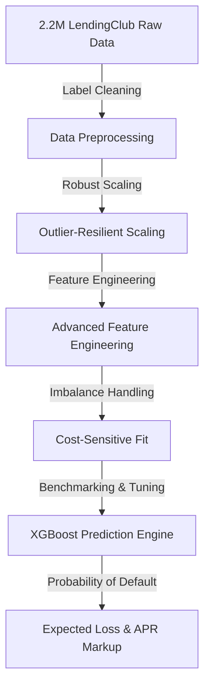

# 🏦 Retail Loan Default Prediction & Risk Analytics Sandbox

[](https://www.python.org)
[](https://retail-loan-default-prediction.streamlit.app/)
[](https://xgboost.readthedocs.io/)
[](https://scikit-learn.org/)
[](https://opensource.org/licenses/MIT)

> An end‑to‑end machine‑learning pipeline & financial underwriting sandbox trained on LendingClub’s historical credit footprint (~2.2 M borrowers). Predicts probability of default, evaluates credit‑risk tiers, computes expected losses, and advises pricing markup.

---

## 🌐 Live Interactive Web Application
Experience the sandbox directly in your browser:

👉 **[Launch Retail Credit Risk Sandbox](https://retail-loan-default-prediction.streamlit.app/)**

---

## 🛠️ Tech Stack
Our architecture combines high‑performance tabular classifiers with a premium, responsive web interface:

| Component            | Technology                     | Role                                           |
|---------------------|--------------------------------|------------------------------------------------|
| Model Ensemble      | **XGBoost & LightGBM**          | Gradient‑boosted decision trees for classification |
| Statistical Baselines| **Scikit‑Learn**                | Robust scaling, logistic regression, random forest, decision tree |
| Web Interface       | **Streamlit**                  | Reactive frontend dashboard with dark‑mode styling |
| Data & Vector Ops   | **Pandas & NumPy**               | Efficient data cleaning and feature engineering |
| Visual Analytics    | **Matplotlib & Seaborn**        | Exploratory plots, ROC/AUC, calibration curves |
| Reporting           | **ReportLab**                   | Dynamic PDF report generation |

---

## 📊 Analytical & Underwriting Approach
The model bridges advanced statistical data science with regulatory underwriting metrics.



### 1️⃣ Data Processing & Outlier Mitigation
- **Categorical Mapping** – Clean and encode credit descriptors (`grade`, `sub_grade`, `home_ownership`, etc.).
- **Cleaning & Scaling** – Apply `RobustScaler` to skewed attributes such as income and loan amount.
- **Imbalance Correction** – Use `scale_pos_weight` in XGBoost and class‑weight balancing.

### 2️⃣ Feature Engineering
| Feature                     | Formula                                    |
|----------------------------|--------------------------------------------|
| Income‑to‑Loan Ratio       | `annual_inc / (loan_amnt + 1)`               |
| Monthly Debt Service Burden | `(installment * 12) / (annual_inc + 1)`      |
| Loan‑to‑Income Ratio       | `loan_amnt / (annual_inc + 1)`               |
| Open Account Ratio         | `open_acc / (total_acc + 1)`                 |
| Total Delinquency Score    | `delinq_2yrs + pub_rec + chargeoff_within_12_mths` |
| High‑Interest Flag         | `1` if `int_rate > 15.99%` else `0`        |

### 3️⃣ Underwriting & Pricing
| Risk Rating | PD Range   | Action        | APR Range |
|------------|------------|---------------|----------|
| 🟢 Low    | < 30 %     | Approved      | 5 % – 10 % |
| 🟡 Medium | 30 % – 55 % | Manual Review | 11 % – 17 % |
| 🔴 High   | > 55 %     | Rejected      | N/A |

*Expected Credit Loss* = `loan_amnt × PD × 0.45` (LGD = 45 %).

---

## 📁 Repository Structure
```
loan-default/
├─ .devcontainer/
│   └─ devcontainer.json
├─ app.py                 # Streamlit sandbox
├─ generate_report.py     # PDF report generator
├─ requirements.txt
├─ README.md
├─ plots/
│   ├─ missing_values.png
│   ├─ class_distribution.png
│   └─ ...
├─ models/
│   ├─ scaler.pkl
│   ├─ xgboost.pkl
│   └─ lightgbm.pkl
└─ Loan_Default_Report.pdf
```

---

## 🚀 Quick Start
1. **Install dependencies**
   ```bash
   pip install -r requirements.txt
   ```
2. **Download the dataset** – place `loan.csv` (≈1.2 GB) in the project root.
3. **Run the notebook**
   ```bash
   jupyter notebook loan_default_prediction.ipynb
   ```
4. **Generate the PDF report**
   ```bash
   python generate_report.py
   ```
5. **Launch the Streamlit app locally**
   ```bash
   streamlit run app.py
   ```

---

## 🔑 Feature Dictionary
Key features include loan amount, term, interest rate, grade, employment length, home ownership, annual income, debt‑to‑income, delinquencies, credit utilization, and more.

---

## ✅ Reproducibility & Auditing
- **Fixed seeds** (`random_state=42`) ensure deterministic results.
- **Pre‑trained preprocessors** (`scaler.pkl`) guarantee consistent scaling during inference.
